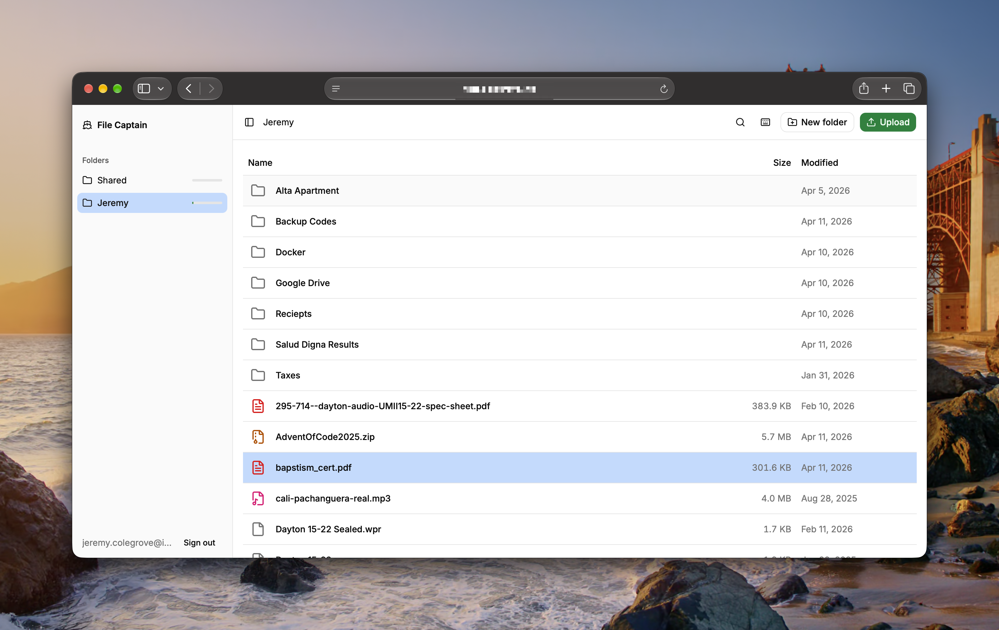
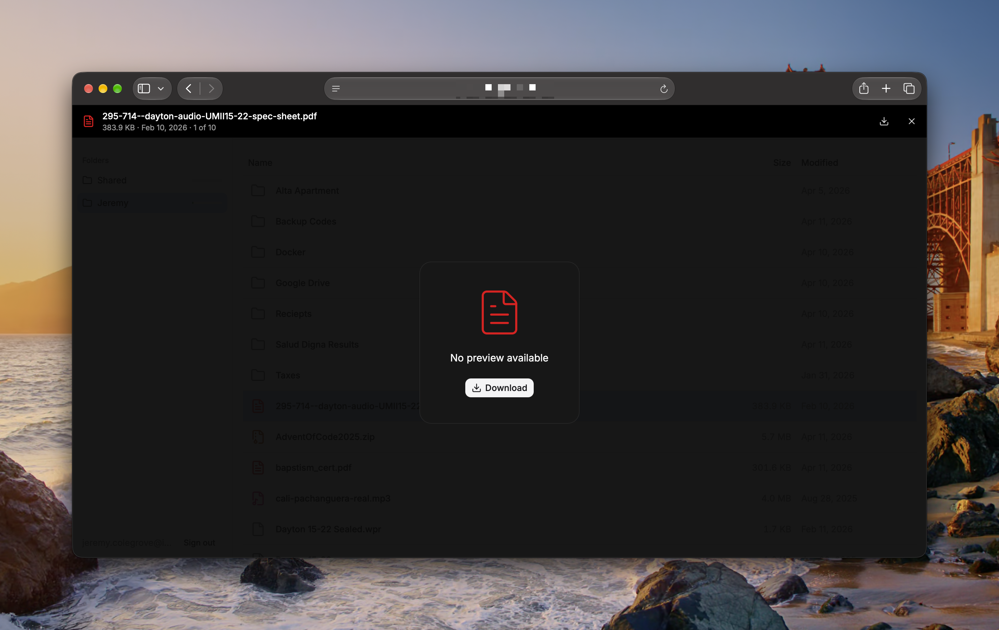
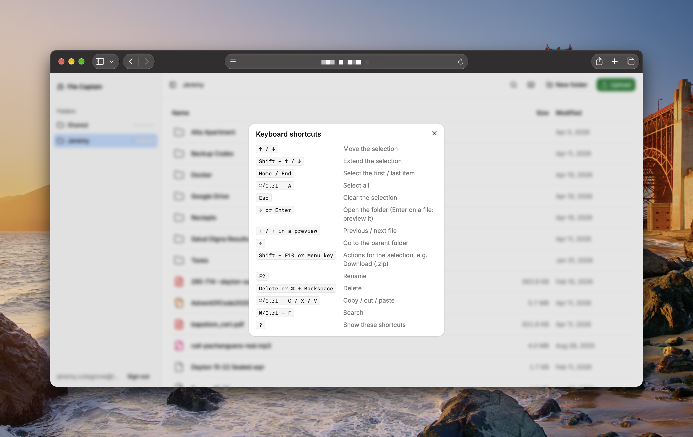
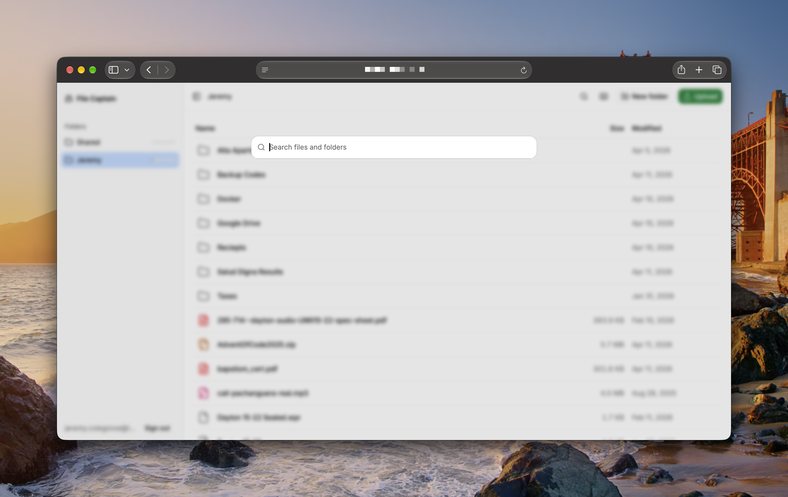

# File Captain

A small, beautiful self-hosted file manager for your browser. Give each person their own folders, share others, and browse, preview, upload, and organize files from any device. It ships as one Docker image, and all setup lives in one `config.yaml`.



## Features

- **Multiple users, scoped folders.** Each folder is shared with everyone, a list of users, or one person. Users only see the folders they're given.
- **Read-only access.** Mark a user or a folder read-only, or give some users read-only access to a folder others can write to. The server enforces this, not just the UI.
- **Everyday file operations.** Upload, download, new folder, rename, move, copy, and delete. Download several items at once as a `.zip`.
- **Resumable uploads.** Large uploads are sent in chunks and pick up where they left off after a dropped connection. Drag and drop works. Existing files are never silently overwritten.
- **Previews.** Open a file to see it full-screen: images, video, audio, and plain text. Use ← / → to move through a folder. Files that can't be previewed show a Download button.
- **Image thumbnails.** Generated on demand and cached on disk.
- **Indexed Search.** Find files by name across every folder you can access (⌘/Ctrl + F).
- **Storage limits.** Set an optional size cap per folder. The sidebar shows how full each folder is.
- **Audit log.** Every login, upload, rename, move, copy, and delete is appended to a JSONL file, including failed attempts.
- **Keyboard-first.** Full keyboard navigation and selection. Press `?` to see every shortcut.
- **Config as code.** Users and folders are defined in `config.yaml`. There's no sign-up page and no admin panel to secure.








## Getting started

File Captain runs as two containers: the app and PostgreSQL (used for sessions). You'll need three files in one directory: `docker-compose.yml`, `config.yaml`, and `.env`.

### 1. `docker-compose.yml`

```yaml
services:
  db:
    image: postgres:18.3-alpine
    restart: unless-stopped
    env_file:
      - .env
    volumes:
      - app-data:/var/lib/postgresql
    healthcheck:
      test: ["CMD-SHELL", "pg_isready -U $${POSTGRES_USER} -d $${POSTGRES_DB}"]
      interval: 5s
      timeout: 5s
      retries: 10

  app:
    image: jeremycolegrove/file-captain:latest
    restart: unless-stopped
    depends_on:
      db:
        condition: service_healthy
    env_file:
      - .env
    environment:
      # Files the app writes get this owner. Find yours with `id -u` / `id -g`.
      PUID: 1000
      PGID: 1000
    ports:
      - "3000:3000"
    volumes:
      # config.yaml is read from /config/config.yaml (override with CONFIG_PATH).
      - ./config.yaml:/config/config.yaml:ro
      # Thumbnail cache and audit log (server.cacheDir / server.auditLog).
      - ./data:/data
      # One line per folder in config.yaml: <host path>:<container path>.
      # The container path (right side) is what goes in that folder's `path:`.
      # PUID:PGID must be able to write the host directories.
      - /mnt/media/shared/global:/shared/global
      - /mnt/media/shared/jeremy:/shared/jeremy
      - /mnt/media/shared/family:/shared/family

volumes:
  app-data:
```

### 2. `config.yaml`

```yaml
server:
  cacheDir: /data/.cache
  auditLog: /data/audit.jsonl
  maxUploadSize: 10GB
  indexIntervalMinutes: 15             # rescan for outside changes; 0 = startup only
  thumbnailConcurrency: 3              # thumbnails generated at once; 1-2 suits HDDs; 0 = off

users:
  - username: jeremy@example.com      # an email address
    password: "change-me-to-something-long"   # 12-128 chars; quote it if it has symbols
  - username: guest@example.com
    password: "change-me-to-something-long-too"
    readOnly: true

# Folder paths are paths *inside the container*. Map each one to a host
# directory under the app's `volumes:` in docker-compose.yml.
folders:
  - name: shared
    path: /shared/global
    users: all
    storageLimit: 1000GB
  - name: jeremy
    path: /shared/jeremy
    users: [jeremy@example.com]
    storageLimit: 200GB
  - name: family
    path: /shared/family
    users: [jeremy@example.com]        # read-write
    readOnlyUsers: [guest@example.com] # list, download and thumbnails only
                                        # (a user in both lists is read-only)
```

A few things to know:

- **Users are managed here only.** On startup, File Captain creates new users, updates changed passwords, and removes users you've deleted from the file. Restart the container after editing.
- **Folders** that don't exist yet are created at startup. `storageLimit` and `readOnly` are optional.
- **Read-only** users and folders can list, preview, and download, but can't change anything.
- The config is validated at startup. If something's wrong, the container exits with an error that says what to fix.

### 3. `.env`

```bash
# Postgres
POSTGRES_USER=filecaptain
POSTGRES_PASSWORD=change-me
POSTGRES_DB=filecaptain

# Must point at the "db" service, not localhost
DATABASE_URL="postgresql://filecaptain:change-me@db:5432/filecaptain"

# Signs login sessions. 32+ random characters, e.g. `openssl rand -base64 32`
BETTER_AUTH_SECRET="..."

# The URL people use to reach File Captain
BETTER_AUTH_URL="https://files.example.com"
```

### 4. Start it

```bash
docker compose up -d
```

Open `http://localhost:3000` (or your `BETTER_AUTH_URL`) and sign in with a user from `config.yaml`. Database migrations run automatically when the container starts.

## Hosting notes

- **Reverse proxy.** Put File Captain behind a reverse proxy with HTTPS (Caddy, Traefik, nginx, etc.) and set `BETTER_AUTH_URL` to the public URL. If your proxy limits request body size, raise it, because uploads are sent in chunks.
- **Permissions.** Set `PUID`/`PGID` to the host user that owns your media folders, so files you upload keep the right ownership.
- **Health check.** `GET /api/health` returns 200 when the app is up.
- **Audit log.** One JSON object per line, for example:
  ```json
  {"ts":"2026-10-01T12:00:00.000Z","user":"alice","action":"move","src":"/a.txt","dst":"/docs/a.txt","result":"ok","ip":"203.0.113.5"}
  ```
- **Changes made outside the app** (e.g. files copied in over SMB) are picked up by the periodic rescan (`indexIntervalMinutes`).

## What it isn't

File Captain is deliberately small. It doesn't do share links or public access, user self-registration, an admin panel, SSO/LDAP, or media transcoding. If you need those, [FileBrowser](https://github.com/filebrowser/filebrowser) or [Nextcloud](https://nextcloud.com) may be a better fit.
